# Safonov Interiors — 18 concepts

Концептуальное портфолио Алексея Сафонова. Все визуализации созданы с помощью AI и показывают атмосферу, материалы и идеи расстановки.

Aleksey Safonov’s concept portfolio. All images are AI-generated and communicate atmosphere, materials and furniture ideas.

## 14. Тихая роскошь / Quiet luxury

**MOSCOW PREMIUM · Level Селигерская · 34,8 м²**

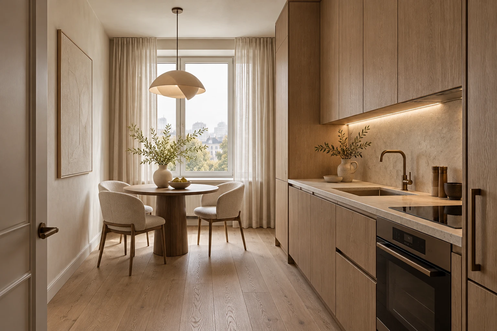

**Визуализация / Rendered room:** Кухня · 12,4 м² / Kitchen · 12.4 m²

Кухня 12,4 м² в оттенках слоновой кости: светлый дуб, каменная фактура и матовая бронза. Круглый стол у окна задаёт спокойный ритм небольшой квартире.

A 12.4 m² kitchen in ivory tones: pale oak, a stone texture and brushed bronze. A round table by the window sets a calm rhythm for the compact apartment.

**Сценарий / Brief:** Для одного человека или пары: отдельная спальня и выразительная кухня для повседневной жизни. / For one person or a couple: a separate bedroom and an elegant kitchen for everyday living.

- Сохранить линейную кухню вдоль внутренней стены; объединить фасады и встроенную технику в один спокойный объём.
  Retain the linear kitchen along the internal wall; unify the cabinetry and integrated appliances into one calm volume.
- Разместить круглый стол у кухонного окна. Диаметр стола и глубину стульев подобрать после проверки проходов на обмерах.
  Place a round table by the kitchen window. Choose its diameter and chair depth after checking circulation against measured dimensions.
- Повторить светлый дуб в спальне 14,8 м² и прихожей, связав отдельные комнаты общей палитрой.
  Repeat pale oak in the 14.8 m² bedroom and hall to connect the separate rooms through a shared palette.

**Свет / Lighting:** Мягкий потолочный свет, подсветка кухонной столешницы и лаконичный подвес над столом. Бронзовые детали поддерживают тёплый вечерний свет. / Soft ceiling light, worktop lighting and a restrained pendant over the table. Bronze details complement the warm evening light.

| Цвет / Material direction | HEX |
| --- | --- |
| Слоновая кость / Ivory | #EAE3D7 |
| Светлый дуб / Pale oak | #C6AA82 |
| Известняк / Limestone | #BDB6A6 |
| Матовая бронза / Brushed bronze | #8B7052 |

**Материалы / Materials:**

- Дуб с открытой текстурой / Open-grain oak
- Светлый камень или керамогранит с фактурой известняка / Pale stone or limestone-textured porcelain
- Льняная обивка / Linen upholstery
- Матовая бронза в светильниках и фурнитуре / Brushed bronze lighting and hardware

[Исходная планировка / Original source plan](../assets/source/01_level_seligerskaya_34_8.svg)

[Квартира на сайте застройщика / Developer apartment listing](https://level.ru/selig/flat/1room/5-1-1/)

[Оригинальный файл застройщика / Developer original file](https://cdn.level.ru/media/core/flat/plane/98fc53c620d6de87128fffa3a24d3a6684bac1c2.svg)

**Источник / Credit:** Level Group / Level Group

**Проверено / Checked:** 2026-10-10

> Исходная планировка застройщика: корпус 5, этаж 2. Площади сохранены из источника. Визуализация показывает концепцию кухни; размеры мебели требуют обмеров.
>
> Original developer plan: building 5, floor 2. Room areas retain the source values. The render illustrates a kitchen concept; furniture dimensions require site measurements.

Самостоятельная AI-концепция, не заказ застройщика или владельца. Геометрия требует проверки по обмерам; виды за окнами условные.

Independent AI concept, not a developer or owner commission. Geometry requires a measured survey; exterior views are illustrative.

---

## 15. Оливковое ателье / Olive atelier

**MOSCOW PREMIUM · Level Мичуринский · этапы 3 и 4 · 42,1 м²**

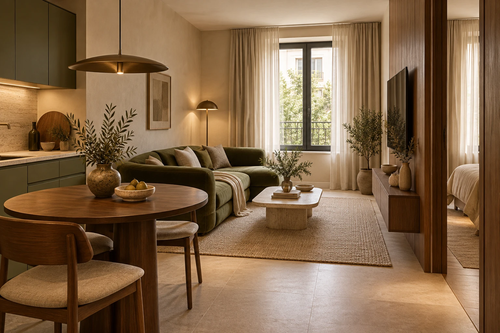

**Визуализация / Rendered room:** Гостиная · 17,2 м² / Living room · 17.2 m²

Гостиная 17,2 м² собрана вокруг глубокого оливкового оттенка, ореха и светлого травертина. Чёткие линии мебели сочетаются с мягкой обивкой и дневным светом.

The 17.2 m² living room pairs a deep olive tone with walnut and pale travertine. Clean furniture lines meet soft upholstery and natural daylight.

**Сценарий / Brief:** Для пары: отдельная спальня, компактная кухня и гостиная с местом для неспешных ужинов. / For a couple: a separate bedroom, compact kitchen and a living room with space for unhurried dinners.

- Сохранить диван вдоль левой стены гостиной и ТВ-зону у перегородки спальни, как на исходном плане.
  Keep the sofa along the left living-room wall and the TV area against the bedroom partition, following the source plan.
- Выделить обеденную зону между кухней и гостиной; использовать лёгкие по силуэту стулья и проверить проход к спальне.
  Define a dining area between the kitchen and living room; choose visually light chairs and check the route to the bedroom.
- Собрать кухню 5 м² в спокойные фасады и повторить орех в хранении гостиной, сохранив цельность интерьера.
  Give the 5 m² kitchen calm, unified cabinetry and repeat walnut in the living-room storage for a coherent interior.

**Свет / Lighting:** Отдельный свет над обеденным столом, мягкая подсветка ТВ-зоны и торшер у дивана. Рабочая поверхность кухни получает собственный свет. / Dedicated lighting above the dining table, soft TV-area lighting and a floor lamp by the sofa. The kitchen worktop has its own task light.

| Цвет / Material direction | HEX |
| --- | --- |
| Глубокая олива / Deep olive | #6D7357 |
| Орех / Walnut | #73533C |
| Травертин / Travertine | #D8CDB8 |
| Тёплый белый / Warm white | #E9E4DA |

**Материалы / Materials:**

- Орех с матовым покрытием / Matte-finished walnut
- Травертин с неброским рисунком / Subtly patterned travertine
- Фактурная оливковая обивка / Textured olive upholstery
- Матовая штукатурка тёплого оттенка / Warm-toned matte plaster

[Исходная планировка / Original source plan](../assets/source/02_level_michurinsky_42_1.svg)

[Квартира на сайте застройщика / Developer apartment listing](https://level.ru/michkomf/flat/2room/8-1-49/)

[Оригинальный файл застройщика / Developer original file](https://cdn.level.ru/media/core/flat/plane/568b20627053bc888ebc242dbda6147599ba2922.svg)

**Источник / Credit:** Level Group / Level Group

**Проверено / Checked:** 2026-10-10

> Исходная планировка застройщика: корпус 8, этаж 6, условный номер 8-1-49. Визуализация — концепция гостиной; план сохраняет отдельную спальню и кухню.
>
> Original developer plan: building 8, floor 6, reference 8-1-49. The render is a living-room concept; the plan retains a separate bedroom and kitchen.

Самостоятельная AI-концепция, не заказ застройщика или владельца. Геометрия требует проверки по обмерам; виды за окнами условные.

Independent AI concept, not a developer or owner commission. Geometry requires a measured survey; exterior views are illustrative.

---

## 16. Парижский вечер / Parisian evening

**MOSCOW PREMIUM · НАЗАРÉ · 47,6 м²**

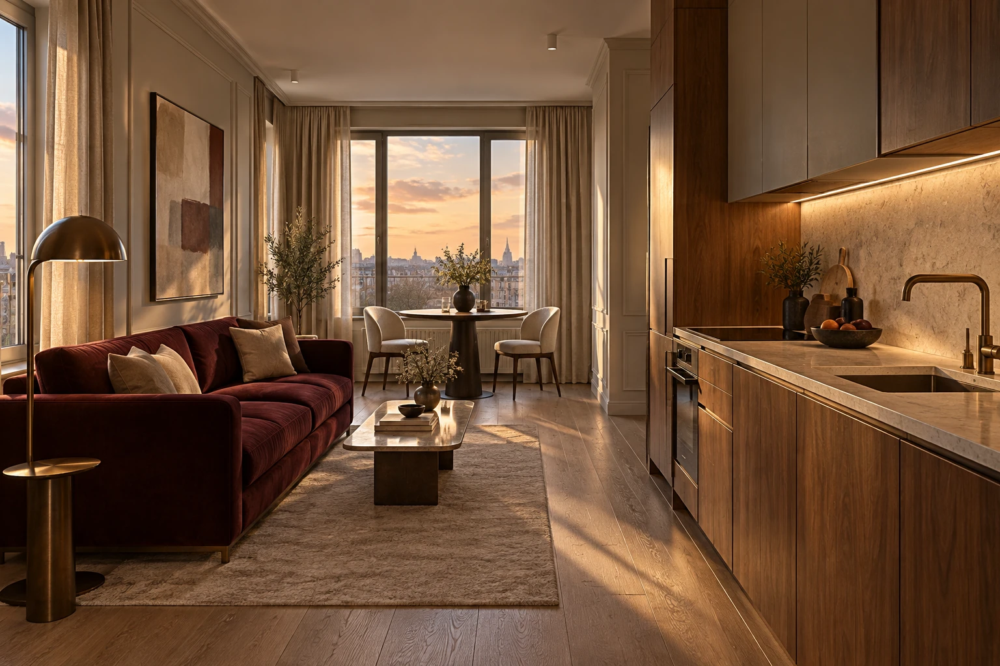

**Визуализация / Rendered room:** Гостиная 16,9 м² + кухня 6 м² / Living room 16.9 m² + kitchen 6 m²

Гостиная 16,9 м² и кухня 6 м² получают общую палитру: тёплый серо-бежевый, орех и винный акцент. Камень и мягкие ткани создают камерную атмосферу.

The 16.9 m² living room and 6 m² kitchen share warm greige, walnut and a wine-red accent. Stone and soft fabrics create an intimate atmosphere.

**Сценарий / Brief:** Для пары, которая любит ужины дома: выразительная общая зона и спокойная отдельная спальня. / For a couple who enjoy dining at home: an expressive shared space and a quiet separate bedroom.

- Сохранить кухню вдоль перегородки спальни; связать её с гостиной общим камнем и тёплыми деревянными фасадами.
  Keep the kitchen along the bedroom partition; connect it to the living room through shared stone and warm wood cabinetry.
- Развить обеденную зону у окна и расстановку дивана вдоль левой стены. Подобрать мебель после проверки фактических проходов.
  Develop the dining area by the window and the sofa position along the left wall. Select furniture after checking actual circulation space.
- Сделать винный цвет локальным акцентом в кресле или текстиле, оставив спальню 14,5 м² в спокойных нейтральных оттенках.
  Use wine red as a local accent in an armchair or textiles, keeping the 14.5 m² bedroom in calm neutral tones.

**Свет / Lighting:** Тёплый подвес над столом, направленный свет над кухонной поверхностью и мягкий свет у дивана. Вечерний сценарий подчёркивает фактуру тканей и камня. / A warm pendant over the table, task lighting over the kitchen surface and soft light beside the sofa. The evening setting brings out fabric and stone textures.

| Цвет / Material direction | HEX |
| --- | --- |
| Тёплый серо-бежевый / Warm greige | #C6BAAE |
| Тёмный орех / Dark walnut | #78523B |
| Винный акцент / Wine-red accent | #713F42 |
| Светлый камень / Pale stone | #E0D5C4 |

**Материалы / Materials:**

- Орех тёплого оттенка / Warm-toned walnut
- Светлый камень с деликатными прожилками / Pale stone with subtle veining
- Шерсть и лён в обивке / Wool and linen upholstery
- Бронзовые акценты / Bronze accents

[Исходная планировка / Original source plan](../assets/source/03_nazare_47_6.svg)

[Квартира на сайте застройщика / Developer apartment listing](https://nazare.ru/genplan/4/20/1151/)

[Оригинальный файл застройщика / Developer original file](https://api.nazare.ru/upload/iblock/a0c/ylu4wwcn8sn74o3glqrzksivnj2mt03g/tmp_importflat-00e36fdb-6d0e-40db-81d2-600410f599b2.svg)

**Источник / Credit:** Мангазея / Mangazeya

**Проверено / Checked:** 2026-10-10

> Исходная планировка квартиры № 1151: корпус 4, этаж 20. Название концепции описывает настроение интерьера. Визуализация не является фотографией квартиры.
>
> Original plan for apartment 1151: building 4, floor 20. The concept name describes the interior mood. The render is not a photograph of the apartment.

Самостоятельная AI-концепция, не заказ застройщика или владельца. Геометрия требует проверки по обмерам; виды за окнами условные.

Independent AI concept, not a developer or owner commission. Geometry requires a measured survey; exterior views are illustrative.

---

## 17. Семейная галерея / Family gallery

**MOSCOW PREMIUM · Нижегородская · 60,64 м²**

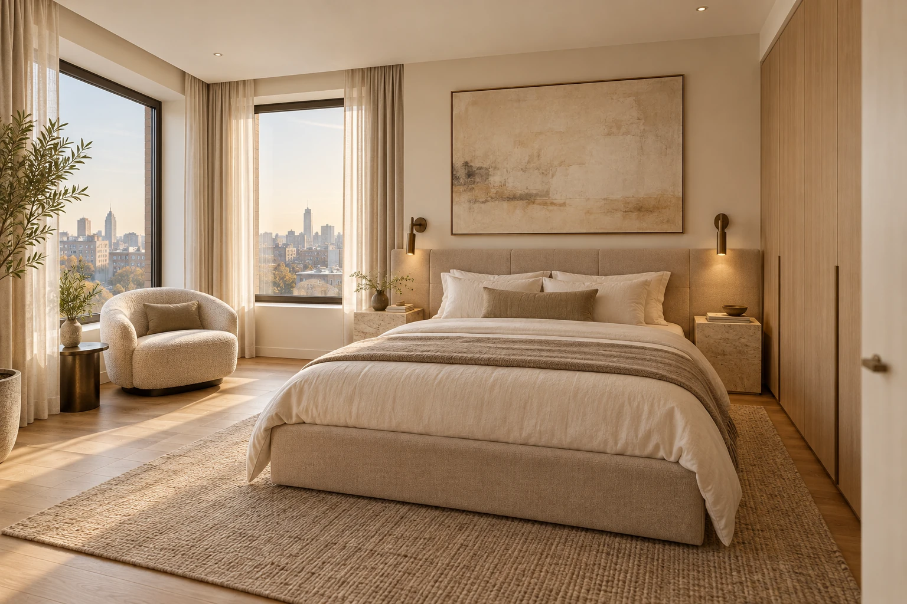

**Визуализация / Rendered room:** Основная спальня · 20,81 м² / Main bedroom · 20.81 m²

Спальня 20,81 м² — просторная личная зона с тёплым дубом, льняными тканями и мягкими бронзовыми деталями. Две стороны естественного света раскрывают фактуры без лишнего декора.

The 20.81 m² bedroom is a generous private retreat with warm oak, linen fabrics and subtle bronze details. Daylight from two sides reveals the textures without excessive decoration.

**Сценарий / Brief:** Для пары или небольшой семьи: две отдельные спальни, кухня 15,11 м² и спокойная палитра общих материалов. / For a couple or a small family: two separate bedrooms, a 15.11 m² kitchen and a calm shared material palette.

- Сохранить спальни 20,81 и 11,64 м² отдельными. Большую комнату оформить как основную спальню, меньшую — по потребностям семьи.
  Keep the 20.81 and 11.64 m² bedrooms separate. Design the larger room as the main bedroom and adapt the smaller one to the family’s needs.
- Развить предусмотренное планом расположение кровати и хранения; избегать высоких предметов перед окнами основной спальни.
  Develop the bed and storage arrangement shown in the plan; avoid tall furniture in front of the main bedroom windows.
- Повторить дуб и светлый камень в кухне 15,11 м². Сохранить самостоятельную обеденную зону и проверить проходы на обмерах.
  Repeat oak and pale stone in the 15.11 m² kitchen. Retain a dedicated dining area and check circulation against site measurements.

**Свет / Lighting:** Рассеянный потолочный свет, отдельные светильники у кровати и подсветка хранения. Мягкий вечерний свет поддерживает спокойную атмосферу спальни. / Diffuse ceiling lighting, individual bedside lights and storage lighting. Soft evening light supports a restful bedroom atmosphere.

| Цвет / Material direction | HEX |
| --- | --- |
| Тёплый дуб / Warm oak | #D8C0A1 |
| Натуральный лён / Natural linen | #E8E0D3 |
| Светлый камень / Pale stone | #BEB4A4 |
| Приглушённая бронза / Muted bronze | #876A50 |

**Материалы / Materials:**

- Тёплый дуб на полу и в мебели / Warm oak flooring and furniture
- Натуральный лён в текстиле / Natural linen textiles
- Светлый камень в небольших деталях / Pale stone in small details
- Матовые бронзовые светильники / Brushed bronze lighting

[Исходная планировка / Original source plan](../assets/source/04_nizhegorodskaya_60_64.png)

[Квартира на сайте застройщика / Developer apartment listing](https://granelle.ru/flats/mypriority-nizhegorodskaya/63660/)

[Оригинальный файл застройщика / Developer original file](https://storage.yandexcloud.net/granelleprod/media/properties/property/plan/c037bba04d9cacc7b5460748ea9369c5126536a5.png)

**Источник / Credit:** Гранель / Granel

**Проверено / Checked:** 2026-10-10

> Исходная планировка квартиры № 535: корпус 1, секция 7, этаж 2. Изображение показывает концепцию основной спальни; исходный план сохранён без изменений.
>
> Original plan for apartment 535: building 1, section 7, floor 2. The image illustrates a main-bedroom concept; the source plan is retained unchanged.

Самостоятельная AI-концепция, не заказ застройщика или владельца. Геометрия требует проверки по обмерам; виды за окнами условные.

Independent AI concept, not a developer or owner commission. Geometry requires a measured survey; exterior views are illustrative.

---

## 18. Резиденция света / Residence of light

**MOSCOW PREMIUM · Will Towers · 72,6 м²**

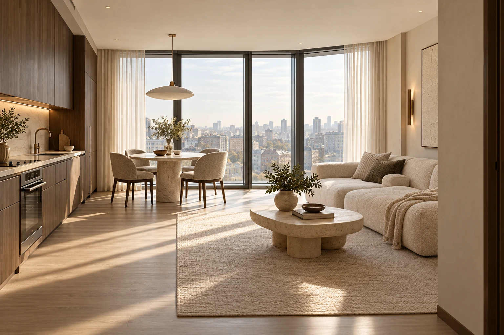

**Визуализация / Rendered room:** Гостиная 25,1 м² + кухня 6,1 м² / Living room 25.1 m² + kitchen 6.1 m²

Гостиная 25,1 м² и кухня 6,1 м² соединяют светлый камень, тёмный дуб и мягкую обивку букле. Ломаная линия остекления становится главным архитектурным акцентом.

The 25.1 m² living room and 6.1 m² kitchen combine pale stone, dark oak and soft bouclé upholstery. The angled glazing line is the main architectural feature.

**Сценарий / Brief:** Для пары: просторная общая зона, отдельная спальня 17,7 м² и предусмотренные планом гардеробная и два санузла. / For a couple: a generous shared space, a separate 17.7 m² bedroom, and a wardrobe room and two bathrooms shown in the plan.

- Сохранить кухню у левой стены и обеденную группу в общей зоне. Связать их с гостиной единой каменной фактурой.
  Keep the kitchen along the left wall and the dining group in the shared area. Connect them to the living room through a consistent stone texture.
- Расположить низкую мягкую мебель в зоне гостиной, сохранив внимание к остеклению и маршруту к спальне.
  Arrange low upholstered furniture in the living area, keeping attention on the glazing and the route to the bedroom.
- Использовать гардеробную 2,4 м² и согласовать хранение в прихожей 13,2 м² после обмеров, не перегружая общую зону.
  Use the 2.4 m² wardrobe room and plan storage in the 13.2 m² hall after site measurements to keep the shared area uncluttered.

**Свет / Lighting:** Дневной свет у остекления, мягкий потолочный свет вечером и выразительный подвес над столом. Локальная подсветка подчёркивает камень и дерево. / Daylight by the glazing, soft ceiling lighting in the evening and a sculptural pendant above the table. Local lighting brings out the stone and wood.

| Цвет / Material direction | HEX |
| --- | --- |
| Светлая слоновая кость / Light ivory | #EEE8DC |
| Тёмный дуб / Dark oak | #5B493B |
| Светлый камень / Pale stone | #D8CFBD |
| Бронза / Bronze | #9A7B55 |

**Материалы / Materials:**

- Светлый камень с мягким рисунком / Pale stone with a soft pattern
- Тёмный дуб в столярных деталях / Dark oak joinery
- Молочное букле / Ivory bouclé
- Бронзовые светильники / Bronze lighting

[Исходная планировка / Original source plan](../assets/source/05_will_towers_72_6.svg)

[Квартира на сайте застройщика / Developer apartment listing](https://ci.ru/choose/13577)

[Оригинальный файл застройщика / Developer original file](https://api.ci.ru/upload/uf/c3b/dezf5zwt2dse5hh51ugfq6259ofwolgo.svg)

**Источник / Credit:** Центр-Инвест / Centr-Invest

**Проверено / Checked:** 2026-10-10

> Исходная планировка квартиры № 1686: этаж 33. Линия фасада и площади взяты из источника. Визуализация представляет интерьерную концепцию общей зоны.
>
> Original plan for apartment 1686: floor 33. The façade line and room areas come from the source. The render presents an interior concept for the shared area.

Самостоятельная AI-концепция, не заказ застройщика или владельца. Геометрия требует проверки по обмерам; виды за окнами условные.

Independent AI concept, not a developer or owner commission. Geometry requires a measured survey; exterior views are illustrative.

---

## 01. Тихий свет / Quiet light

**Белый Град · 37,2 м²**

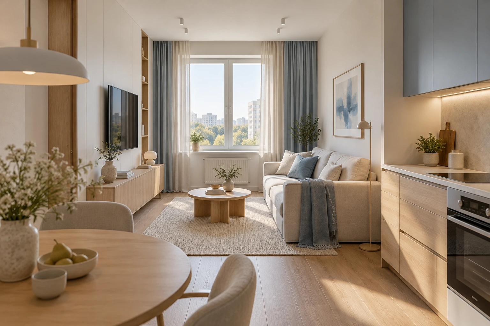

Светлый дуб, льняные фактуры и голубой акцент объединяют небольшую кухню с гостиной. Закрытая спальня остаётся спокойной зоной отдыха.

Pale oak, linen textures and a blue accent connect the compact kitchen and living area. The separate bedroom stays a quiet retreat.

**Сценарий / Brief:** Для одного человека или пары: полноценная спальня, обеды вдвоём и спокойные вечера дома. / For one person or a couple: a separate bedroom, dinner for two and relaxed evenings at home.

- Развить расстановку из исходного плана: прямой диван у правой стены и неглубокая ТВ-тумба у перегородки спальни.
  Develop the source layout: a straight sofa along the right wall and shallow TV storage against the bedroom partition.
- Собрать кухню в единый светлый объём; обеденный стол на двоих расположить на границе кухонной и жилой зон.
  Keep the kitchen visually unified and place a two-person table between the kitchen and living zones.
- Использовать шкаф в прихожей и место под кроватью; заменить разрозненные полки закрытым хранением.
  Use the hall wardrobe and under-bed space; replace scattered shelves with closed storage.

**Свет / Lighting:** Рассеянный потолочный свет, подсветка рабочей поверхности и отдельный торшер рядом с диваном. / Diffuse ceiling light, task lighting over the worktop and a separate reading lamp beside the sofa.

| Цвет / Material direction | HEX |
| --- | --- |
| Мел / Chalk | #E8E2D5 |
| Светлый дуб / Pale oak | #C4A67E |
| Голубой лён / Blue linen | #A3B6C4 |
| Мягкий графит / Soft graphite | #6A6C60 |

[Исходная планировка / Original source plan](../assets/source/01-1000028489.jpg)

> Одна планировка встречается на 17-м и 20-м этажах. В портфолио это один кейс. Площади комнат приведены с округлением из источника.
>
> The same layout appears on floors 17 and 20 and is presented as one case. Room areas retain the source's rounding.

---

## 02. Терракотовый завтрак / Terracotta breakfast

**Белый Град · 35,2 м²**

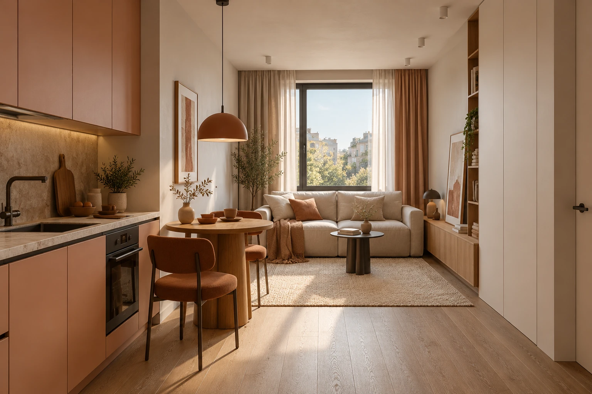

Кухня-гостиная становится главным местом встречи. Терракотовые фасады и круглый стол добавляют тепла, а ровные линии хранения сохраняют порядок.

The kitchen-living room is the social centre. Terracotta cabinetry and a round table add warmth, while flush storage keeps the space calm.

**Сценарий / Brief:** Для пары, которая любит готовить и принимать одного-двух гостей. / For a couple who enjoy cooking and hosting one or two guests.

- Сохранить кухню у входа в жилую зону; холодильник и бытовое хранение собрать в высокий шкаф.
  Keep the kitchen at the entrance end and combine the fridge and household storage in a tall unit.
- Выбрать круглый стол и компактный диван; проверить проход между столом и дверью спальни на обмерах.
  Choose a round table and compact sofa; check circulation to the bedroom door against measured dimensions.
- Продолжить спокойные фасады в спальню и прихожую, чтобы небольшая квартира воспринималась цельно.
  Repeat the calm cabinetry in the bedroom and hall to give the small home a coherent identity.

**Свет / Lighting:** Подвес над столом, свет под верхними шкафами и мягкий свет у дивана. / A pendant above the table, under-cabinet task light and a soft lamp near the sofa.

| Цвет / Material direction | HEX |
| --- | --- |
| Тёплый белый / Warm white | #E9DFCF |
| Терракота / Terracotta | #AD735D |
| Дуб / Oak | #C9A579 |
| Бронза / Bronze | #65534A |

[Исходная планировка / Original source plan](../assets/source/01-1000028489.jpg)

> Повтор планировки есть в другом объявлении. Площади комнат округлены в исходном плане.
>
> This layout repeats in another listing. The source room areas are rounded.

---

## 03. Тёплый камень / Warm stone

**Белый Град · 37,9 м²**

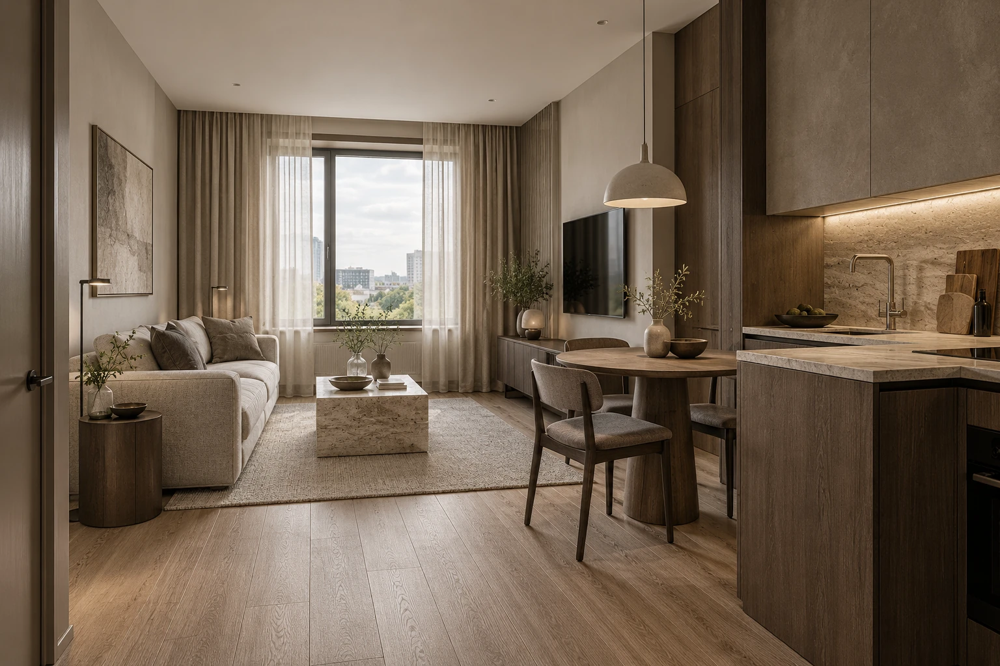

Каменная фактура и дымчатое дерево задают спокойный интерьер. Отдельная спальня и объединённая дневная зона поддерживают разные ритмы жизни.

Stone texture and smoked wood create a calm interior. A separate bedroom and connected daytime spaces support different daily rhythms.

**Сценарий / Brief:** Для пары: удобная кухня, место для отдыха и визуально спокойный фон для жизни. / For a couple: a practical kitchen, a place to unwind and a visually calm home.

- Сохранить кухонную нишу 5,8 м² и связать её с гостиной одинаковым напольным покрытием.
  Retain the 5.8 m² kitchen niche and connect it to the living room with continuous flooring.
- Использовать неглубокую ТВ-зону и компактный журнальный стол; оставить свободным маршрут от входа к окну.
  Use a shallow TV unit and compact coffee table; keep the route from the entrance to the window clear.
- В спальне предусмотреть закрытый шкаф и настенные светильники вместо крупных прикроватных тумб.
  Provide a closed wardrobe and wall lights in the bedroom instead of bulky bedside furniture.

**Свет / Lighting:** Спокойный общий свет, рабочая подсветка кухни и отдельный вечерний сценарий гостиной. / Calm ambient light, kitchen task lighting and a separate evening setting for the living room.

| Цвет / Material direction | HEX |
| --- | --- |
| Тёплый камень / Warm stone | #C5BBA9 |
| Грибной серый / Mushroom grey | #8D8272 |
| Дымчатый дуб / Smoked oak | #857057 |
| Светлый металл / Light metal | #D4D2CB |

[Исходная планировка / Original source plan](../assets/source/05-1000028485.jpg)

> Планировка повторяется на 15-м и 18-м этажах. Это один концептуальный проект.
>
> The layout appears on floors 15 and 18 and is treated as one concept project.

---

## 04. Оливковый ритм / Olive rhythm

**Белый Град · 34,6 м²**

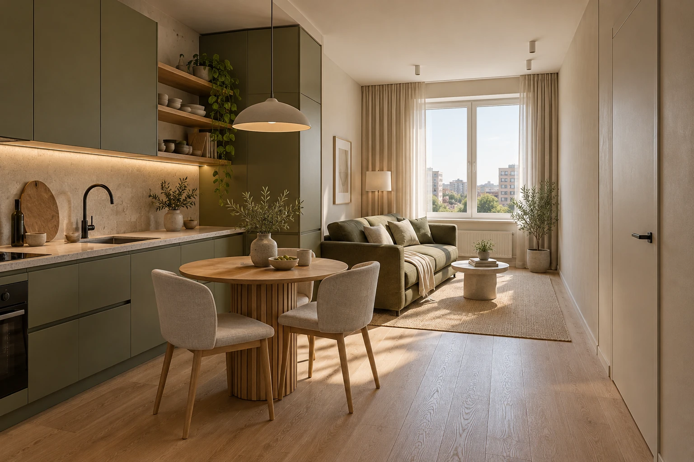

Оливковая кухня и светлый дуб делают небольшую дневную зону мягкой и собранной. Спальня остаётся отдельной, а хранение встраивается в спокойные объёмы.

Olive cabinetry and pale oak give the compact daytime space a gentle, composed feel. The bedroom remains separate, with storage integrated into quiet volumes.

**Сценарий / Brief:** Для одного человека или пары: готовить, отдыхать и быстро возвращать квартире порядок. / For one person or a couple: cooking, unwinding and easily restoring order.

- Разместить компактную кухню вдоль существующих стен и отделить её от гостиной круглым столом.
  Keep a compact kitchen along the existing walls and use a round table to define its boundary with the living area.
- Поставить небольшой прямой диван в светлой части комнаты; бытовые мелочи убрать в закрытые шкафы.
  Place a small straight sofa in the brighter part of the room and store everyday items behind closed doors.
- В спальне использовать светлые фасады и текстиль; сохранить существующее расположение санузла.
  Use pale cabinetry and textiles in the bedroom and retain the existing bathroom location.

**Свет / Lighting:** Подвес над столом, подсветка кухни и мягкий боковой свет для отдыха. / A dining pendant, kitchen task lighting and soft side light for relaxing.

| Цвет / Material direction | HEX |
| --- | --- |
| Олива / Olive | #73785C |
| Светлый дуб / Pale oak | #CEB58F |
| Тёплый мел / Warm chalk | #ECE6D9 |
| Лён / Flax | #B9AA8F |

[Исходная планировка / Original source plan](../assets/source/07-1000028481.jpg)

> Планировка встречается на 9-м и 22-м этажах. Сумма округлённых площадей комнат немного отличается от общей площади в объявлении.
>
> The layout appears on floors 9 and 22. The rounded room areas differ slightly from the listing's total area.

---

## 05. Графит и орех / Graphite & walnut

**Белый Град · 38,1 м²**

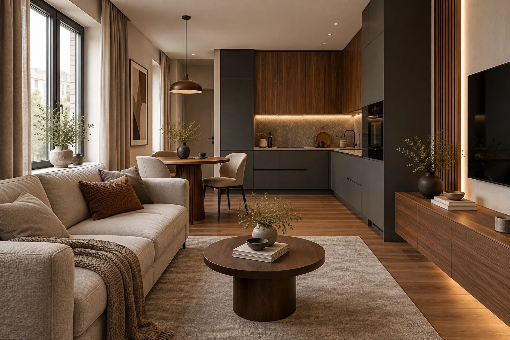

Графитовая кухня и тёплый орех создают более камерное настроение. Свет из бокового окна подчёркивает дерево, а светлый текстиль уравновешивает тёмные фасады.

Graphite cabinetry and warm walnut create an intimate mood. Side-window light brings out the wood, while pale textiles balance the darker finishes.

**Сценарий / Brief:** Для пары, которая предпочитает выразительные материалы и спокойный вечерний интерьер. / For a couple who enjoy expressive materials and a calm evening atmosphere.

- Развить Г-образную кухню по исходному плану; облегчить верхний ярус светлыми фасадами.
  Develop the source's L-shaped kitchen and use pale upper cabinetry to keep it visually light.
- Сохранить прямой диван и круглый стол; подобрать мебель после проверки открывания входной двери.
  Retain a straight sofa and round table; select their sizes after checking the entrance door swing.
- В спальне повторить дерево в небольших деталях, оставив основные поверхности светлыми.
  Repeat wood in small bedroom details while keeping the main surfaces pale.

**Свет / Lighting:** Рабочий свет кухни, подсветка хранения и локальные лампы для тёплого вечернего сценария. / Kitchen task lights, storage lighting and local lamps for a warm evening setting.

| Цвет / Material direction | HEX |
| --- | --- |
| Графит / Graphite | #4E504A |
| Орех / Walnut | #79533B |
| Песочный / Sand | #D5C4AD |
| Тёплый белый / Warm white | #EBE5D9 |

[Исходная планировка / Original source plan](../assets/source/03-1000028487.jpg)

> Общая площадь указана как 38,1 м²; подписи комнат дают 37,9 м². Для рабочего проекта потребуется уточнённый план.
>
> The listing states 38.1 m², while the room labels total 37.9 m². A verified plan is needed for detailed design.

---

## 06. Средиземное утро / Mediterranean morning

**Киноквартал · 33,3 м²**

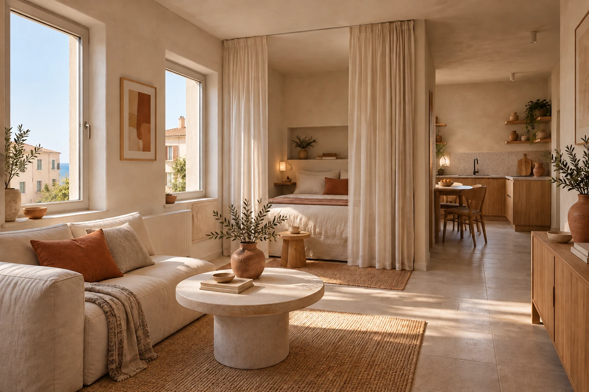

Студия с отдельной кухонной нишей получает мягкое разделение отдыха и сна. Известковые оттенки, глина и простые ткани создают ощущение спокойного утра.

A studio with a kitchen niche gains a gentle separation between living and sleeping. Limewash tones, clay and simple textiles create a quiet morning mood.

**Сценарий / Brief:** Для одного человека: отдельное место для сна и светлая зона отдыха без капитальной перестройки. / For one person: a defined sleeping area and a bright living zone without structural rebuilding.

- Оставить кухню в нише; выделить спальное место лёгкой шторой, положение которой уточняется на полном плане.
  Keep the kitchen in its niche and define a sleeping area with a light curtain, positioned after reviewing the complete plan.
- Использовать компактный диван и небольшие столики вместо крупной мебельной группы.
  Use a compact loveseat and small tables instead of a large furniture grouping.
- Встроить хранение у входа; сохранить свободный подход к обоим окнам.
  Integrate storage at the entrance and keep access to both windows clear.

**Свет / Lighting:** Мягкий общий свет и отдельные лампы в зоне сна и отдыха. / Soft ambient lighting and separate lamps for sleeping and relaxing.

| Цвет / Material direction | HEX |
| --- | --- |
| Известковый белый / Limewash white | #EBE3D5 |
| Глина / Clay | #B67D63 |
| Дуб / Oak | #C7A781 |
| Лён / Flax | #CDBFA9 |

[Исходная планировка / Original source plan](../assets/source/04-1000028484.jpg)

> Нижняя часть плана обрезана в скриншоте. Положение мебели и границ спальной зоны показано как идея и требует полного плана.
>
> The bottom of the plan is cut off in the screenshot. Furniture and sleeping-zone boundaries are conceptual and require the complete plan.

---

## 07. Дом для троих / A home for three

**Орнамент · 44,4 м²**

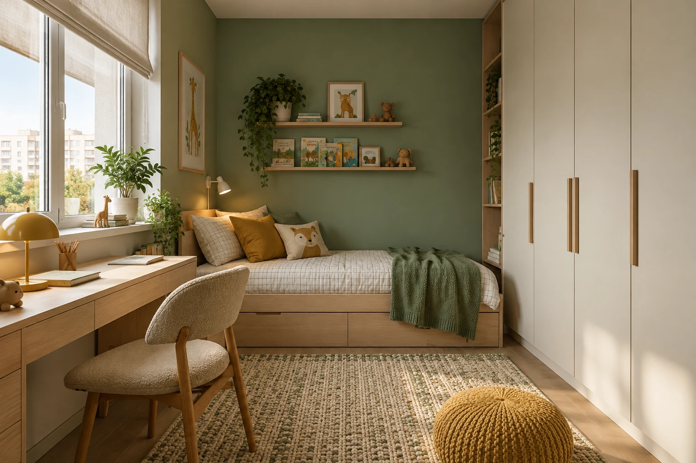

Две отдельные комнаты позволяют разделить взрослый и детский ритмы. Спокойная зелёная палитра, берёза и закрытое хранение объединяют семейную квартиру.

Two separate rooms accommodate adult and child routines. A calm green palette, birch and closed storage give this family home a coherent feel.

**Сценарий / Brief:** Для семьи с одним ребёнком: две спальни, рабочее место ребёнка и отдельная кухня для общих завтраков. / For a family with one child: two bedrooms, a child's desk and a separate kitchen for shared breakfasts.

- Комнату 15,7 м² использовать как спальню родителей, 10 м² — как детскую с односпальной кроватью и столом.
  Use the 15.7 m² room as the parents' bedroom and the 10 m² room for a child's single bed and desk.
- Разместить детский стол у окна; книги хранить на доступной высоте, а одежду — в закрытом шкафу.
  Place the child's desk near the window, keep books within reach and clothes in a closed wardrobe.
- Сохранить отдельную кухню 8,1 м²; объединить бытовое хранение в прихожей, сохраняя свободные проходы.
  Retain the separate 8.1 m² kitchen and consolidate household storage in the hall while keeping circulation clear.

**Свет / Lighting:** Общий свет, рабочая лампа на столе и мягкий вечерний свет в детской. / Ambient lighting, a desk lamp and gentle evening light in the child's room.

| Цвет / Material direction | HEX |
| --- | --- |
| Шалфей / Sage | #99AC8E |
| Берёза / Birch | #D8C098 |
| Кремовый / Cream | #ECE5D6 |
| Горчичный акцент / Mustard accent | #BBA05A |

[Исходная планировка / Original source plan](../assets/source/04-1000028484.jpg)

> Назначение двух комнат предложено для выбранного семейного сценария. Все исходные стены и мокрые зоны сохранены в концепции.
>
> Room uses are proposed for the selected family scenario. The concept retains the source walls and wet zones.

---

## 08. Пудра и дуб / Blush & oak

**Белый Град · 34,9 м²**

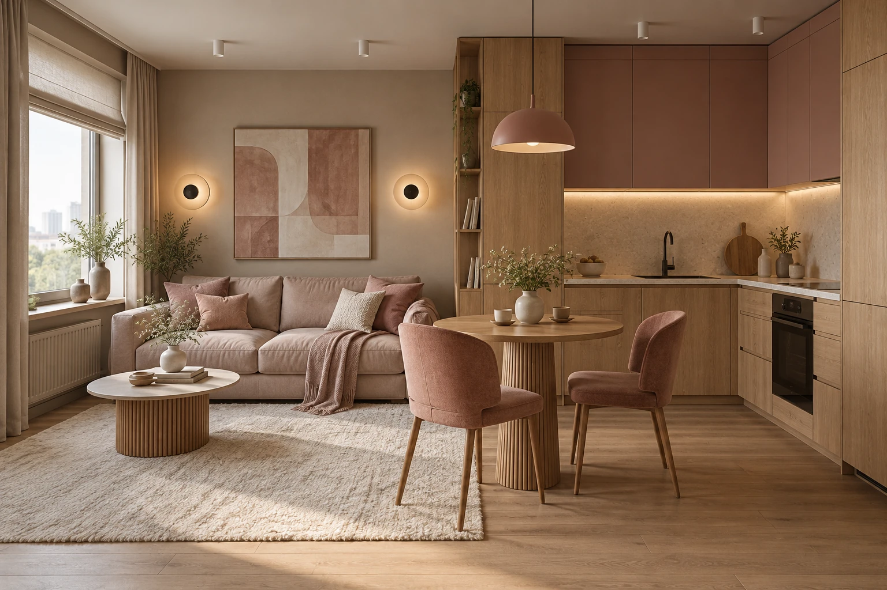

Пудровые оттенки и светлый дуб смягчают компактную дневную зону. Круглый стол и лёгкая мебель помогают сохранить цельное пространство кухни и гостиной.

Blush tones and pale oak soften the compact daytime area. A round table and light furniture keep the kitchen and living room visually connected.

**Сценарий / Brief:** Для пары: отдельная спальня, компактная кухня и уютное место для разговора. / For a couple: a separate bedroom, compact kitchen and a comfortable place to talk.

- Сохранить кухню 5,3 м² и расположение дивана из исходного плана; выбирать мебель по фактической ширине комнаты.
  Retain the 5.3 m² kitchen and source sofa position; select furniture using measured room widths.
- Для обедов предусмотреть небольшой круглый стол; настенные светильники освобождают поверхность мебели.
  Use a small round dining table and wall lights to keep furniture surfaces free.
- Собрать шкаф у входа и хранение в спальне в простые светлые объёмы.
  Organise the entry wardrobe and bedroom storage into simple pale volumes.

**Свет / Lighting:** Рабочая подсветка кухни, подвес над столом и настенные светильники у дивана. / Kitchen task lighting, a dining pendant and wall lights near the sofa.

| Цвет / Material direction | HEX |
| --- | --- |
| Пудровый / Blush | #C6A293 |
| Дуб / Oak | #CAB18A |
| Слоновая кость / Ivory | #EDE4D5 |
| Тёмный акцент / Dark accent | #4C4943 |

[Исходная планировка / Original source plan](../assets/source/06-1000028486.jpg)

> Дневная зона компактная: точные размеры стола, дивана и открывание дверей требуют проверки на обмерах.
>
> The daytime area is compact: table and sofa dimensions and door swings need checking against site measurements.

---

## 09. Северный берег / Northern shore

**Белый Град · 37,5 м²**

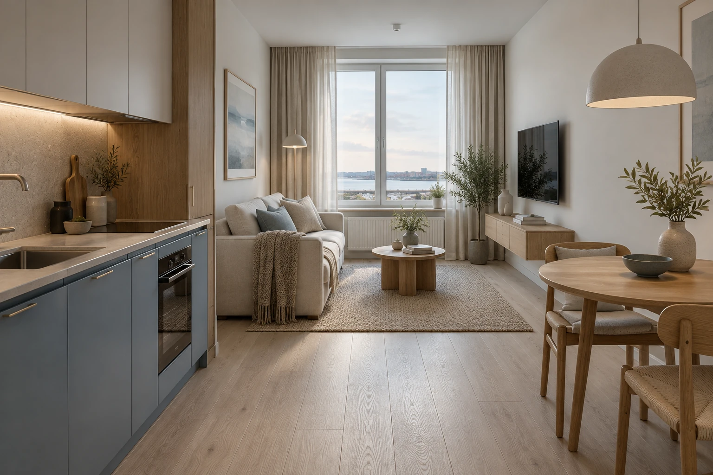

Приглушённый синий, натуральный дуб и светлый лён поддерживают спокойное настроение. Кухня и гостиная объединены цветом, а спальня остаётся отдельной.

Muted blue, natural oak and pale linen create a calm mood. Colour connects the kitchen and living room while the bedroom remains separate.

**Сценарий / Brief:** Для одного человека или пары, которым нужен светлый дом с простым уходом и понятным хранением. / For one person or a couple seeking a bright home with easy upkeep and organised storage.

- Оставить кухню у входа в дневную зону; синим выделить нижние фасады, верхние сделать светлыми.
  Keep the kitchen at the entrance end; use blue for lower cabinetry and pale finishes above.
- Поставить прямой диван у боковой стены и небольшую ТВ-тумбу; сохранить свободный доступ к окну.
  Use a straight sofa along the side wall and a small TV unit, keeping access to the window clear.
- В спальне использовать хранение под кроватью и закрытый шкаф; повторить синий в текстиле.
  Use under-bed storage and a closed bedroom wardrobe, repeating blue in the textiles.

**Свет / Lighting:** Рассеянный общий свет, подсветка кухни и лампа для чтения в гостиной. / Diffuse ambient lighting, kitchen task light and a living-room reading lamp.

| Цвет / Material direction | HEX |
| --- | --- |
| Северный синий / Nordic blue | #839DA8 |
| Натуральный дуб / Natural oak | #CDB28D |
| Белый мел / White chalk | #EFE8DB |
| Льняной / Flax | #B5A68D |

[Исходная планировка / Original source plan](../assets/source/06-1000028486.jpg)

> Площади комнат округлены в исходном плане. Общая площадь взята из карточки объявления.
>
> Room areas are rounded in the source plan. Total area is taken from the listing card.

---

## 10. Больше воздуха / Room to breathe

**Шолохово · 40,9 м²**

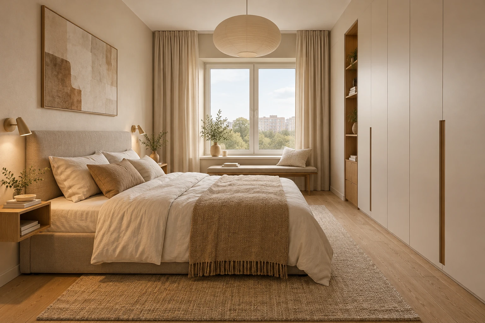

Более просторная жилая комната получает полноценное место для сна и тихий уголок для чтения. Кухня остаётся отдельной, а существующая лоджия сохраняет своё назначение.

The larger main room accommodates a bed and a quiet reading corner. The kitchen stays separate and the existing loggia retains its role.

**Сценарий / Brief:** Для одного человека или пары: отдельная кухня и спокойная спальня с местом для чтения. / For one person or a couple: a separate kitchen and calm bedroom with space to read.

- В комнате 17,93 м² разместить кровать, неглубокое хранение и кресло либо небольшую скамью у окна.
  Use the 17.93 m² room for a bed, shallow storage and a chair or small bench near the window.
- Сохранить кухню 12,37 м² и существующие инженерные зоны; подобрать обеденную группу после обмеров.
  Retain the 12.37 m² kitchen and existing services; size the dining furniture after measurements.
- Лоджию использовать как сезонное пространство. Двери и тепловой контур остаются на своих местах.
  Use the loggia seasonally, retaining its doors and the home's existing thermal boundary.

**Свет / Lighting:** Отдельный свет для чтения, мягкое освещение у кровати и рабочий свет в кухне. / A reading light, soft bedside lighting and kitchen task lighting.

| Цвет / Material direction | HEX |
| --- | --- |
| Кремовый / Cream | #E8DFCD |
| Светлый дуб / Pale oak | #C5AC87 |
| Алебастр / Alabaster | #DED6C5 |
| Карамель / Caramel | #BA926E |

[Исходная планировка / Original source plan](../assets/source/07-1000028481.jpg)

> В объявлении 40,9 м², на плане 38,93 / 40,93 м². Для лоджии подписаны 4,00 / 2,00 м². Эти значения сохранены раздельно; верхняя часть схемы обрезана.
>
> The listing states 40.9 m²; the plan shows 38.93 / 40.93 m² and a loggia marked 4.00 / 2.00 m². These figures remain distinct; the top of the drawing is cut off.

---

## 11. Одна комната, три сценария / One room, three rhythms

**Публицист · 25,3 м²**

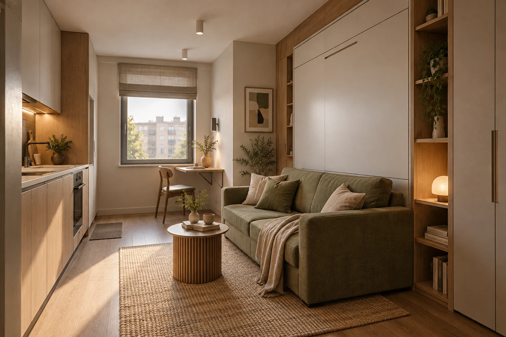

Самая маленькая студия в подборке меняет сценарий в течение дня: сон, работа и отдых. Закрытое хранение и трансформируемая мебель помогают освободить основную комнату.

The smallest studio in the collection changes throughout the day: sleeping, working and relaxing. Closed storage and adaptable furniture free up the main room.

**Сценарий / Brief:** Для одного человека: возможность работать дома и убирать спальное место днём. / For one person: working from home and folding away the bed during the day.

- Рассмотреть шкаф-кровать и компактный диван в комнате 12,7 м²; механизм и зоны открывания проверить по точным размерам.
  Consider a wall bed and compact sofa in the 12.7 m² room; verify the mechanism and opening clearances with exact measurements.
- Организовать небольшой откидной рабочий стол у окна и хранение до потолка в зоне входа.
  Provide a small foldable desk near the window and full-height storage at the entrance.
- Оставить кухонную нишу 3,9 м² и санузел 4,35 м² в исходном расположении.
  Retain the 3.9 m² kitchen niche and 4.35 m² bathroom in their source positions.

**Свет / Lighting:** Рабочая лампа, подсветка кухни и мягкий вечерний свет; управление по отдельным зонам. / A desk lamp, kitchen task light and soft evening lighting, controlled by zone.

| Цвет / Material direction | HEX |
| --- | --- |
| Тёплый белый / Warm white | #ECE5D8 |
| Дуб / Oak | #C8A77D |
| Глина-тауп / Clay taupe | #A59580 |
| Приглушённая олива / Muted olive | #7E856B |

[Исходная планировка / Original source plan](../assets/source/08-1000028483.jpg)

> Исходный план небольшого разрешения. Трансформируемая мебель показана как принцип; для выбора механизма нужен размерный план.
>
> The source plan has limited resolution. Adaptable furniture is a design principle; a dimensioned plan is needed to specify its mechanism.

---

## 12. Карамельная студия / Caramel studio

**Гранель Мытищи · 30,1 м²**

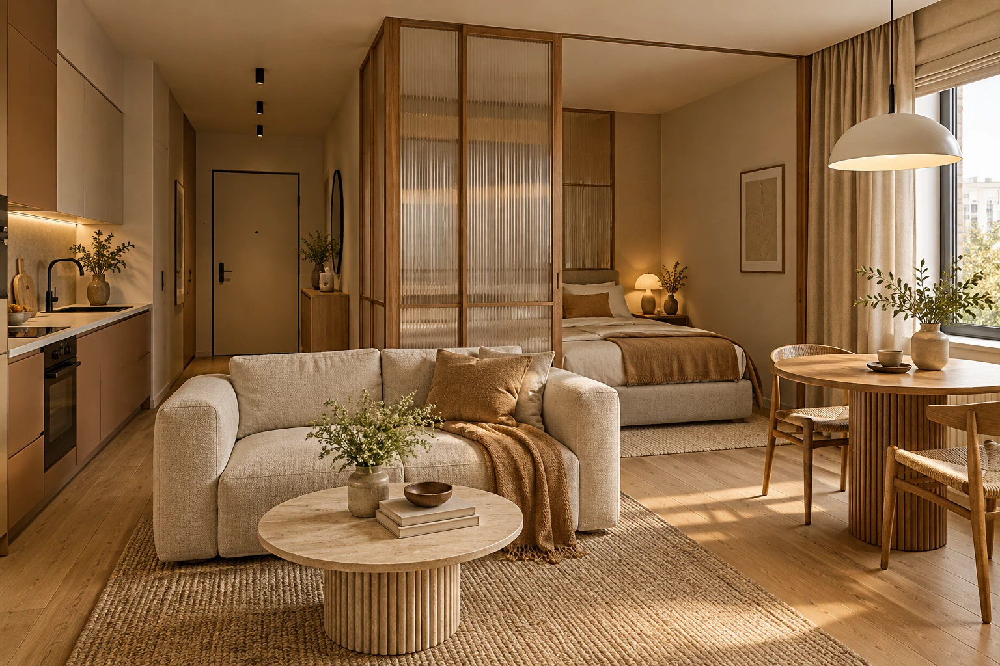

Тёплая карамель и светлый дуб объединяют кухню, отдых и сон. Лёгкий экран из рифлёного стекла предлагает мягкое разделение общей комнаты.

Warm caramel and pale oak connect cooking, relaxing and sleeping. A light fluted-glass screen suggests a gentle division of the main room.

**Сценарий / Brief:** Для одного человека: визуально отделить спальное место и сохранить дневной свет в студии. / For one person: give the bed visual privacy while preserving daylight in the studio.

- Рассмотреть съёмный экран у спального места; его положение уточнить по читаемому плану и расположению окна.
  Consider a removable screen beside the bed; verify its position using a legible plan and window location.
- Выбрать компактный диван и стол на двоих; сохранить кухню в существующей нише.
  Choose a compact loveseat and table for two; keep the kitchen in its existing niche.
- Закрытое хранение сосредоточить у входа, чтобы основная комната оставалась спокойной.
  Concentrate closed storage near the entrance to keep the main room calm.

**Свет / Lighting:** Рабочий свет кухни, подвес над столом и локальный свет у кровати. / Kitchen task lighting, a dining pendant and a bedside lamp.

| Цвет / Material direction | HEX |
| --- | --- |
| Карамель / Caramel | #BD9571 |
| Слоновая кость / Ivory | #EDE3D4 |
| Дуб / Oak | #C5A478 |
| Тёмная линия / Dark line | #45453F |

[Исходная планировка / Original source plan](../assets/source/08-1000028483.jpg)

> Карточка указывает 30,14 м² и этаж 9 из 12, текст объявления — 30,1 м² и этаж 9 из 13. Подписи комнат недостаточно чёткие и не перенесены в таблицу. Концепция предварительная.
>
> The graphic states 30.14 m² and floor 9 of 12; the listing text states 30.1 m² and floor 9 of 13. Room labels are too unclear to transcribe. This is a preliminary concept.

---

## 13. Комната для жизни / Space for everyday life

**Котельники парк · 37 м²**

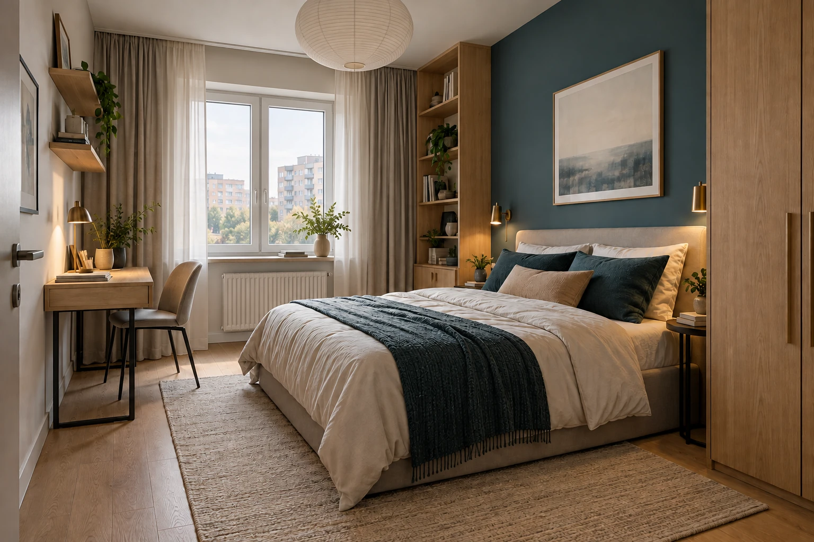

Отдельная кухня и гардеробная позволяют разгрузить небольшую спальню. Глубокий синий акцент, дуб и светлые стены создают собранный городской интерьер.

A separate kitchen and storage room keep the small bedroom uncluttered. A deep blue accent, oak and pale walls create a composed urban home.

**Сценарий / Brief:** Для одного человека или пары: отдельная спальня, самостоятельная кухня и удобное хранение одежды. / For one person or a couple: a separate bedroom, independent kitchen and organised clothes storage.

- Сохранить существующую гардеробную 3 м²; в спальне 10 м² ограничиться кроватью и лёгким рабочим местом, если размеры это позволят.
  Retain the existing 3 m² storage room; keep the 10 m² bedroom to a bed and a light desk, subject to measured clearances.
- Кухню 12 м² использовать как место для приготовления и совместных обедов.
  Use the 12 m² kitchen for cooking and shared meals.
- Лоджию сохранить отделённой от квартиры; хранение бытовых вещей организовать в прихожей.
  Keep the loggia separate from the apartment and organise household storage in the hall.

**Свет / Lighting:** Лампа для работы, свет у кровати и отдельная подсветка гардеробной. / A task lamp, bedside lighting and a separate light for the storage room.

| Цвет / Material direction | HEX |
| --- | --- |
| Глубокий синий / Petrol blue | #3C666D |
| Светлый дуб / Pale oak | #C7AC85 |
| Тёплый белый / Warm white | #EAE4D7 |
| Матовый металл / Brushed metal | #99998E |

[Исходная планировка / Original source plan](../assets/source/09-1000028482.jpg)

> На плане лоджия подписана 1,5 / 3,0 м². Общая площадь в карточке — 37 м²; площадь лоджии не смешивается с площадями внутренних комнат.
>
> The plan marks the loggia as 1.5 / 3.0 m². The listing total is 37 m²; the loggia figures remain separate from the internal room areas.
